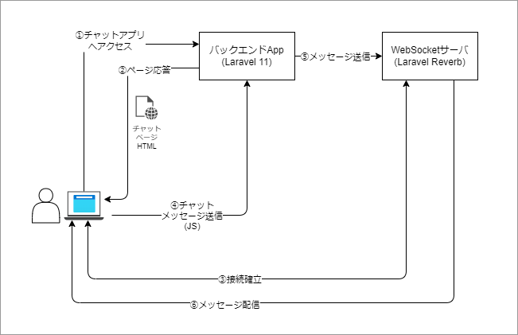

# minimum-chat-app
Laravel 11 と Laravel Reverbを使用して、簡易的なチャットアプリを作成するハンズオン



## 手順メモ
### 1. laravelインストール
```
composer create-project laravel/laravel app-base
```

### 2. プロジェクト構成の整理
```
shopt -s dotglob && mv app-base/* .
```
```
rm -rf .github
```

### 3. プロジェクトの起動確認
```
php artisan serve
```
`http://127.0.0.1:8000` でアクセスできたらOK

### 4. Lravel Reverbのセットアップ
Lravel Reverbは今年リリースされた Laravel 11 と一緒に登場した、 Laravel 公式の WebSocket サーバ機能

```
php artisan install:broadcasting
```

選択肢は以下
```
 ┌ Would you like to install Laravel Reverb? ───────────────────┐
 │ Yes                                                          │
 └──────────────────────────────────────────────────────────────┘
```
```
 ┌ Would you like to install and build the Node dependencies required for broadcasting? ┐
 │ Yes                                                                                  │
 └──────────────────────────────────────────────────────────────────────────────────────┘
```
※ `laravel-echo` と `pusher-js` がインストールされる

### 5. コード書き換え
laravel側とjs少し追記

`routes/channels.php`
```php
# チャネル定義
Broadcast::channel('chat', function () {
    return true;
});
```

`routes/web.php`
```php
# チャット送信
Route::post('/send', function (Request $request) {
    Broadcast::on('chat')->with([ "message" => $request->message])->as("NewMessage")->sendNow();
});
```

`resources/views/welcome.blade.php`
```html
<!DOCTYPE html>
<html lang="{{ str_replace('_', '-', app()->getLocale()) }}">
    <head>
        <meta charset="utf-8">
        <meta name="viewport" content="width=device-width, initial-scale=1">

        <title>チャット</title>

        <!-- Fonts -->
        <link rel="preconnect" href="https://fonts.bunny.net">
        <link href="https://fonts.bunny.net/css?family=figtree:400,600&display=swap" rel="stylesheet" />

        @vite(['resources/js/app.js'])
    </head>
    <body>
        <input type="text" id="message" name="message" placeholder="メッセージ">
        <button id="send">送信</button>
        <ul id="entries"></ul>
    </body>
</html>
```

`resources/js/bootstrap.js`
```javascript
document.addEventListener("DOMContentLoaded", () => {
  document.getElementById('send').addEventListener('click', () => {
      const message = document.getElementById('message').value;
      if (message) {
      axios.post('/send', { message: message }).then(() => {
          document.getElementById('message').value = '';
      });
      }
  });
});

window.Echo.channel('chat').listen('.NewMessage', (e) => {
  const messageElm = document.createElement("li");
  messageElm.textContent = e.message

  document.getElementById('entries').appendChild(messageElm);
});
```

### 6. Laravel Reverb起動
```
php artisan reverb:start --debug
```

### 7. vite ローカルサーバ起動
```
npm run dev
```

### 8. Laravel バックエンドAPP起動
```
php artisan serve
```

## 動作
1. 複数のタブ or ウィンドウでページを開く。
2. どちらか一方でメッセージを入力して送信を押下する。
3. 別のタブ or ウィンドウで開いているページ側にも送信したメッセージが追加される。